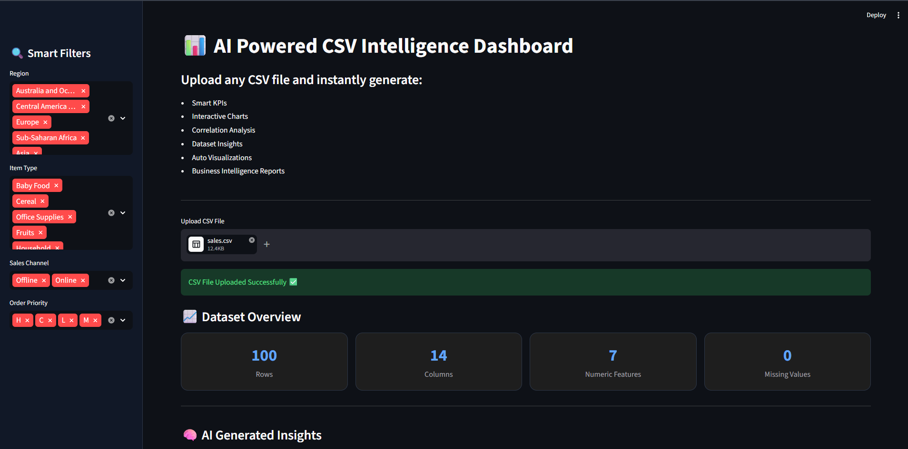
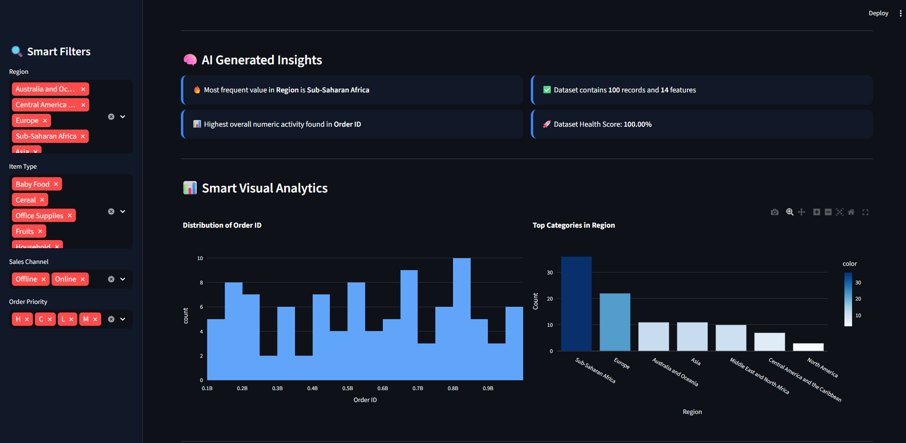
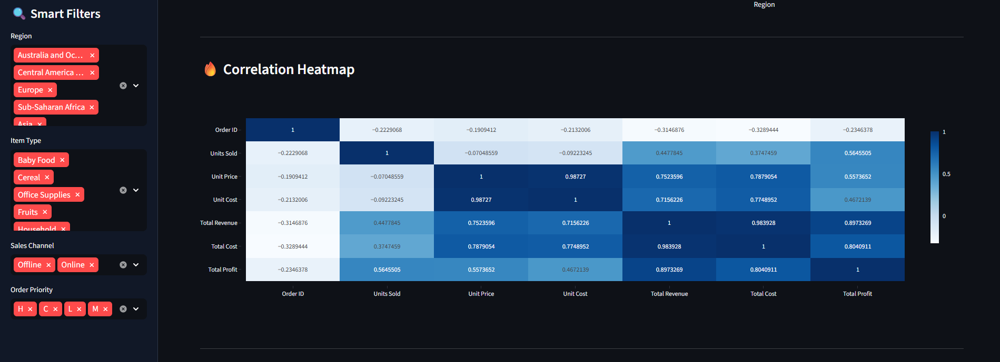
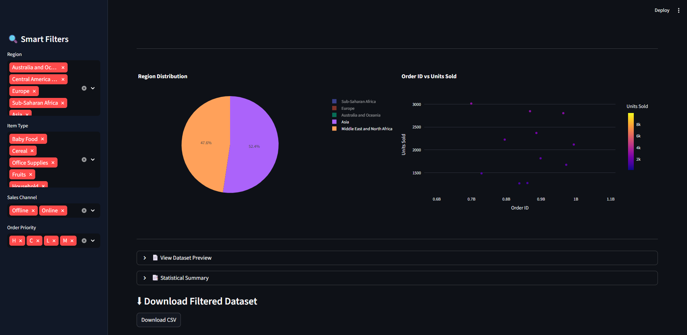

# 📊 AI Powered CSV Intelligence Dashboard

An advanced AI-powered analytics dashboard built using Python, Streamlit, Pandas and Plotly.

Upload ANY CSV file and automatically generate:

- 📈 Interactive Charts
- 📊 KPI Metrics
- 🔥 Correlation Heatmaps
- 🧠 AI Generated Insights
- 🎯 Smart Filters
- 📉 Statistical Summaries
- 📥 Downloadable Filtered Data
- ⚡ Automatic Visual Analytics

---

# 🚀 Live Demo

## 🌐 Streamlit App
https://supplement-sales-intelligence-dashboard.streamlit.app/

## 💻 GitHub Repository
https://github.com/pranayv-09/AI-Powered-CSV-Intelligence-Dashboard

---

# 🖼️ Project Screenshots

## Dashboard Overview


## AI Insights & Smart Analytics


## Correlation Heatmap


## Smart Visualizations


---

# 🛠️ Technologies Used

- Python
- Streamlit
- Pandas
- NumPy
- Plotly
- Scikit-Learn

---

# ✨ Features

## ✅ Universal CSV Support

Upload any CSV file irrespective of:
- Column names
- Row count
- Dataset type

---

## ✅ Smart Filtering System

Dynamic sidebar filters generated automatically based on categorical columns.

---

## ✅ AI Generated Insights

Automatically detects:
- Dominant categories
- Dataset health
- Numerical trends
- Feature statistics

---

## ✅ Automatic Visual Analytics

Generates:
- Histograms
- Scatter Plots
- Bar Charts
- Pie Charts
- Correlation Heatmaps

---

## ✅ Statistical Analysis

Includes:
- Mean
- Median
- Standard Deviation
- Correlation Analysis
- Missing Value Analysis

---

# 📂 Project Structure

```bash
AI-Powered-CSV-Intelligence-Dashboard/
│
├── app.py
├── requirements.txt
├── README.md
├── .gitignore
│
├── images/
├── data/
├── notebooks/
├── scripts/
└── dashboards/
```

---

# ▶️ Run Locally

Clone the repository:

```bash
git clone https://github.com/pranayv-09/AI-Powered-CSV-Intelligence-Dashboard.git
```

Install dependencies:

```bash
pip install -r requirements.txt
```

Run the app:

```bash
streamlit run app.py
```

---

# 🌐 Deployment

Deployed using Streamlit Cloud.

---

# 🎯 Use Cases

- Business Intelligence
- Sales Analytics
- CSV Data Exploration
- Data Visualization
- Exploratory Data Analysis
- Dataset Health Monitoring
- Automated Reporting

---

# 👨‍💻 Author

## Pranay Verma

Built with Python, Machine Learning and Streamlit.

---

# ⭐ Future Improvements

- AI Chat with CSV
- Forecasting Module
- PDF Report Export
- Machine Learning Predictions
- SQL Database Integration
- User Authentication
- Advanced Business Intelligence Reports
