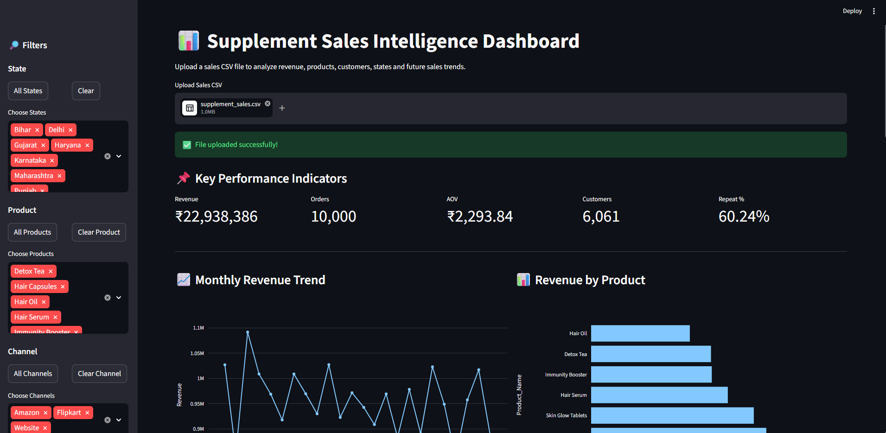
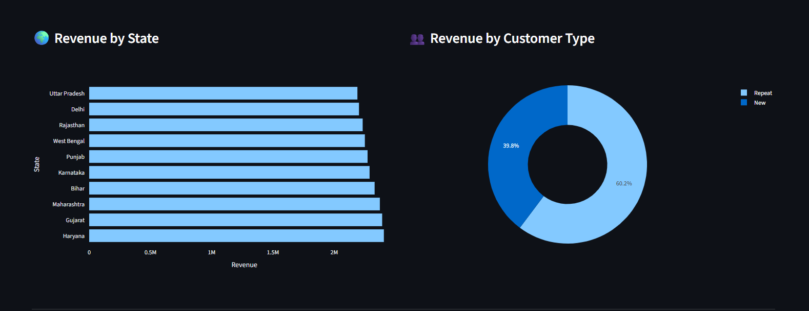
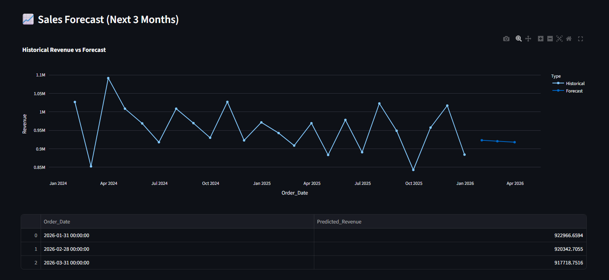
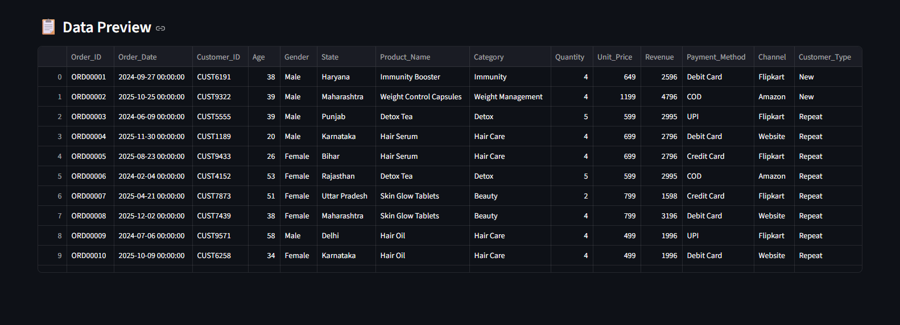

# 📊 Supplement Sales Intelligence Dashboard

An end-to-end Data Analytics project built using Python, Power BI, and Streamlit to analyze supplement sales data, generate business insights, and forecast future revenue trends.

---

## 🚀 Project Overview

This project simulates a real-world supplement sales business and provides:

- Sales Performance Analysis
- Product-wise Revenue Insights
- State-wise Revenue Analysis
- Customer Segmentation
- Interactive Dashboard Filtering
- Revenue Forecasting for Future Months
- CSV Upload & Dynamic Dashboard Updates

The project demonstrates the complete Data Analytics workflow from raw data generation to deployment-ready dashboards.

---

## 🛠 Tech Stack

### Programming & Analysis
- Python
- Pandas
- NumPy
- Matplotlib
- Seaborn

### Forecasting
- Scikit-Learn
- Linear Regression

### Dashboarding
- Power BI
- Streamlit
- Plotly

### Development Environment
- VS Code
- Jupyter Notebook

---

## 📂 Project Structure

```text
SUPPLEMENT-SALES-INTELLIGENCE/
│
├── dashboards/
│   └── Supplement_Sales_Dashboard.pbix
│
├── data/
│   ├── raw/
│   │   └── supplement_sales.csv
│   │
│   └── processed/
│       ├── clean_supplement_sales.csv
│       ├── dashboard_data.csv
│       └── monthly_revenue.csv
│
├── images/
│   ├── dashboard_overview.png
│   ├── state_customer_analysis.png
│   ├── forecast_analysis.png
│   └── data_preview.png
│
├── notebooks/
│   ├── 01_data_inspection.ipynb
│   ├── 02_data_cleaning.ipynb
│   ├── 03_eda.ipynb
│   ├── 04_forecasting.ipynb
│   └── 05_dashboard_dataset.ipynb
│
├── scripts/
│   └── generate_dataset.py
│
├── app.py
├── requirements.txt
├── .gitignore
└── README.md
```

---

## 📈 Key Features

### KPI Dashboard

- Total Revenue
- Total Orders
- Average Order Value (AOV)
- Total Customers
- Repeat Customer Percentage

---

### Revenue Analysis

- Monthly Revenue Trend
- Revenue by Product
- Revenue by State
- Revenue by Customer Type

---

### Interactive Filters

Users can filter dashboard data by:

- State
- Product
- Sales Channel

The dashboard updates automatically based on selected filters.

---

### Revenue Forecasting

A machine learning model predicts future monthly revenue using historical sales data.

Forecast includes:

- Historical Revenue Trend
- Next 3 Months Revenue Prediction
- Forecast Visualization

---

## 📸 Dashboard Screenshots

### Main Dashboard



---

### State & Customer Analysis



---

### Sales Forecasting



---

### Data Preview



---

## 📊 Dataset Information

The dataset contains:

| Feature | Description |
|----------|-------------|
| Order_ID | Unique Order Identifier |
| Order_Date | Order Date |
| Customer_ID | Customer Identifier |
| Age | Customer Age |
| Gender | Customer Gender |
| State | Customer State |
| Product_Name | Product Purchased |
| Category | Product Category |
| Quantity | Units Sold |
| Unit_Price | Product Price |
| Revenue | Sales Revenue |
| Payment_Method | Payment Method |
| Channel | Sales Channel |
| Customer_Type | New / Repeat Customer |

Total Records:

```text
10,000+
```

---

## ▶️ Running the Streamlit Dashboard

Install dependencies:

```bash
pip install -r requirements.txt
```

Run the application:

```bash
streamlit run app.py
```

Open:

```text
http://localhost:8501
```

---

## 📊 Power BI Dashboard

The project also includes an interactive Power BI dashboard featuring:

- Executive KPI View
- Product Performance Analysis
- State Performance Analysis
- Customer Segmentation

File:

```text
dashboards/Supplement_Sales_Dashboard.pbix
```

---

## 🎯 Business Insights Generated

Examples:

- Identify top-selling products
- Discover highest revenue states
- Analyze customer retention
- Compare sales channels
- Monitor monthly sales trends
- Forecast future business revenue

---

## 👨‍💻 Author

Pranay Verma

Aspiring Data Analyst | Data Science Enthusiast

Skills:
- Python
- SQL
- Power BI
- Excel
- Machine Learning
- Data Visualization

---

## ⭐ Future Improvements

- Streamlit Cloud Deployment
- Advanced Time Series Forecasting
- Customer Lifetime Value Analysis
- Sales Recommendation Engine
- Real Database Integration
- Automated Report Generation